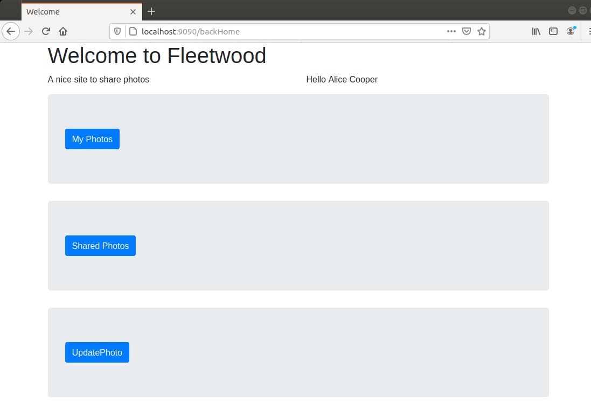

# sharewood-locksmith
I present here a new version of a previous photo sharing demo project. This version uses a local Keycloak authorization server and OIDC protocol.
Here are the prerequisites for running this project:

A recent Docker installed (I use 19.03.13)
A recent Maven installed (I use 3.6.0)

An IDE such as STS can help but is not required.

# 1. Building the authorization server

## 1.1. Creating a persistence volume for the Keycloak authorization server

The volume name is: `keycloak-data`.

## 1.2. Initializing the Keycloak server

Go to the directory `dockerbuild`.
Start a new Keycloak server as a container with this docker-compose.yml file:

```
version: '3.4'

services:

  postgres:
    image: postgres
    environment:
      - POSTGRES_DB=keycloak
      - POSTGRES_USER=keycloak
      - POSTGRES_PASSWORD=password
    volumes:
      - keycloak:/var/lib/postgresql/data

  keycloak:
    image: jboss/keycloak:latest
    environment:
      - DB_VENDOR=postgres
      - DB_ADDR=postgres
      - DB_DATABASE=keycloak
      - DB_USER=keycloak
      - DB_PASSWORD=password
      - KEYCLOAK_USER=admin
      - KEYCLOAK_PASSWORD=admin
    ports:
      - 8080:8080
    depends_on:
      - postgres

volumes:

  keycloak:
    external: true
    name: keycloak-data
``` 

The Keycloak server listen on localhost:8080. Connect to admin console with username admin and password admin. 
Click Add Realm and import the JSON file: `dockerbuild/keycloak/sharewood-realm.json`
The sharewood realm is ready to be used. It contains the declaration of fleetwood client and two users with usenames alice and carol.


 
## 1.3. Initializing the Photo PostgreSQL database

Create a new volume for Photo entity persistence. The volume is named `sharewood-data`.
Go to the directory `dockerbuild/postgresql` and run the script: `createPhotosDB`. 
It will start a PostgreSQL container mapped to the `sharewood-data` volume. 
Then run the script `populatePhotosDB`. It will populate the `sharewood` database. On password prompt enter `password1234`.
Then kill the container by running the script `killCreate`.
The `sharewood` database is now persisted in the dedicated volume and ready to be used.

## 1.4 Creating the sharewood-server container

In `sharewood-server` run the script `build`. It creates a Docker image named sharewood-server:0.0.1-SNAPSHOT.
Note that the actual build is executed only if all tests are successful. Some static paths have to be edited to match the actual file system. 
Got to directory `dockerbuild/sharewood` and run the script `build`. It creates an derived image named `sharewood-server:latest` prepopulated with 6 JPG files.

# 2 Running the application

## 2.1 Running the resource server as a container
Go to the directory `docker` and run the command `docker-compose up`. It starts both the sharewood resource server and the Keycloak authorization server.
In a browser hit the URL localhost:8080 and check that Keycloak is running as expected. Then in `fleetwood` run the command `mvn clean spring-boot:run`. It start the fleetwood client. By hitting the URL localhost:9090 you get this page provided by Keycloak: 
 


Login by username or by email address. Two users are registered:

Username | Email address             | Password
---------|---------------------------| ---------
alice    | alice.cooper@enclume.com  | alice1234
carol    | carol.baker@enclume.com   | carol1234

After a successful login the fleetwood welcome page appears.



Then the user can execute the request with tag MyPhotos and display all her existing photos. She also can add new photos, make any photo shared using the Update request and of course delete a photo using the Delete request.


## 2.2 Running the resource server on localhost

It is also possible to run the resource server on localhost, e.g. for debugging purpose. In this case the sharewood server should be commented out in the docker-compose file. The choice is enabled by the application.yml that contains three different profiles, default, test and docker as shown below:

```
server: 
  port: 9091
  servlet: 
    context-path: /
   
spring:
  datasource:
    url: jdbc:postgresql://localhost:8432/sharewood
    username: postgres
    password: password1234
  jpa: 
    hibernate: 
      naming:
        physical-strategy: org.hibernate.boot.model.naming.PhysicalNamingStrategyStandardImpl
   
   
####### resource server configuration properties
  security:
    oauth2:
      resourceserver:
        jwt:
          issuer-uri: http://localhost:8080/auth/realms/sharewood
      
      
jwkSetUri: http://localhost:8080/auth/realms/sharewood/protocol/openid-connect/certs
 
basePhotosURL: http://localhost:9091/photos 
 
photosDir: /home/dominique/Documents/sharewood-locksmith/photos
photosSaveDir: /home/dominique/Documents/sharewood-locksmith/photosSave
   
baseDirPath: /home/dominique/Documents/sharewood-locksmith/photos/
   
   
logging:
  level:
    root: INFO
    com.dub.microservices: DEBUG
    org.hibernate.SQL: DEBUG
    org.hibernate.type.descriptor.sql.BasicBinder: TRACE
    
--- 

spring:
  config:
    activate:
      on-profile: test
      
      
spring.datasource.url: jdbc:h2:mem:sharewood;DB_CLOSE_ON_EXIT=FALSE

spring.datasource.hikari.initializationFailTimeout: 60000
      
--- 

spring:
  config:
    activate:
      on-profile: docker
   
  datasource:
    url: ${POSTGRES_URL}
    username: postgres
    password: password1234
  jpa: 
    hibernate: 
      naming:
        physical-strategy: org.hibernate.boot.model.naming.PhysicalNamingStrategyStandardImpl
   
####### resource server configuration properties
  security:
    oauth2:
      resourceserver:
        jwt:
          #issuer-uri: http://localhost:8080/auth/realms/sharewood
          issuer-uri: ${ISSUER_URI}
      
 
#jwkSetUri: http://localhost:8080/auth/realms/sharewood/protocol/openid-connect/certs
      
jwkSetUri: ${JWKSET_URI}
   
    
baseDirPath: /tmp/photos/
``` 

Cachan, November 23


Dominique Ubersfeld 
 


 
